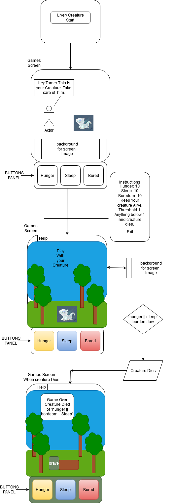

https://pages.git.generalassemb.ly/abewallah/tamgachi-first-project/.

# tamgachi-first-project

# Instructions on Playing the Game Lively Creatures

# 1: User Names the Creature and Clicks Enter Name Button.

# 2: User Starts the game using the Start Game Button.

# 3: The game is to keep the three Stats Hunger Sleep and Bored above Zero. Each Stat starts at 100.

# 4: When game starts the three stats will begin to decrease by different amounts.

# 5: The User can click each rescpective icon buttons eat, sleep, and play. This will increase each stat by a unique sum.

# 6: Each icon has a animation representing the activity.

# 7: There is a fourth stat which is age its time based. Every n seconds it will increase by one.

# 8: If the age reaches Three a hidden button will appear for the User that will give the option to evolve the creature.

# 9: If a stat reaches zero then the creature dies and the User will get a message stating that its game over.

# 10: User can then restart by clicking the Game Over button which will restart the User to the Cover Page to declare a new name.
